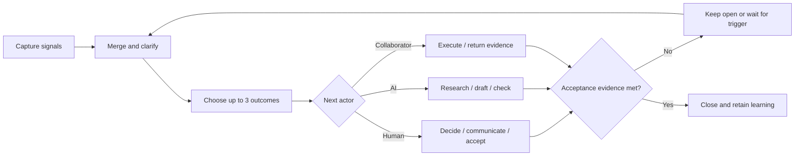

# AI Co-Brain Workflow

By <span class="notranslate" translate="no">Soya</span>

> Turn an endless to-do list into a human–AI coordination loop.

AI Co-Brain Workflow is a tool-agnostic, local-first method for people handling many parallel workstreams. It helps an AI assistant answer three questions that ordinary task lists leave unresolved:

1. **Who owns the next move — me, AI, or a collaborator?**
2. **Should this task appear now, or only after a date or dependency changes?**
3. **What evidence is required before the task is truly complete?**

This repository contains documentation, prompts, templates, and fictional examples. It does **not** connect to your inbox, calendar, chat, or task manager, and it does not claim proven productivity gains for every user.

[中文说明](README.md) · [Install Skill](skills/ai-cobrain/SKILL.md) · [Quick start](docs/quickstart.md) · [Fallback prompt](prompts/cobrain-secretary.md) · [Privacy](docs/privacy-and-security.md)

## Install the Skill

The core reusable asset is the [`ai-cobrain`](skills/ai-cobrain/SKILL.md) Skill. It requires no private plugin or organization-specific system.

### Codex

```bash
git clone https://github.com/soyoungzsy/ai-cobrain-workflow.git
mkdir -p ~/.codex/skills
cp -R ai-cobrain-workflow/skills/ai-cobrain ~/.codex/skills/
```

### Claude Code

```bash
git clone https://github.com/soyoungzsy/ai-cobrain-workflow.git
mkdir -p ~/.claude/skills
cp -R ai-cobrain-workflow/skills/ai-cobrain ~/.claude/skills/
```

Restart the client, then say:

```text
Use $ai-cobrain to turn the following items into today's three outcomes
and complete the safe AI-owned work now.
```

Use the [fallback prompt](prompts/cobrain-secretary.md) only when Skill installation is unavailable.

## Why another workflow?

Most systems are good at collecting tasks. They are weaker at coordinating work after collection:

- every unfinished item keeps demanding attention;
- “sent”, “approved”, or “configured” gets mistaken for “done”;
- the next actor is unclear;
- waiting tasks reappear every day without new information;
- AI creates more text but does not reduce coordination load.

AI Co-Brain Workflow treats a task as a **stateful handoff**, not a checkbox.

## The loop



The working shorthand is:

`Capture → Prioritize → Route → Wait → Verify → Learn`

## Manager and direct-report use case

The collaborator lane can include a direct report, teammate, cross-functional partner, or external collaborator. For a direct report, the AI can prepare a concise daily to-do list with the intended result, action for today, expected evidence, dependency, and escalation condition. The manager confirms priorities and ownership before assignment.

This is a coordination aid, not an employee-surveillance system. Do not infer effort, attitude, or performance from message volume, response speed, or task metadata.

## What makes it different

| Mechanism | What it prevents |
| --- | --- |
| Maximum three daily outcomes | A long backlog pretending to be a plan |
| One explicit next actor | Everyone watching, nobody moving |
| Trigger-based waiting | Future work consuming today’s attention |
| Acceptance criteria | Premature completion |
| Human gates | AI guessing owners, deadlines, or high-risk decisions |
| Daily calibration | A static prompt that never learns your judgment |

## Fallback without Skill installation

1. Copy [`prompts/cobrain-secretary.md`](prompts/cobrain-secretary.md) into your AI assistant.
2. Paste a small, sanitized set of tasks from the last one to three days.
3. Correct only four things: priority, next actor, trigger, and acceptance criteria.
4. Use [`templates/daily-workbench.md`](templates/daily-workbench.md) for the output.
5. At the end of the day, tell the assistant what it ranked incorrectly or closed too early.

Start with one project. Do not connect every source on day one.

## Repository map

```text
ai-cobrain-workflow/
├── README.md
├── README.en.md
├── docs/
│   ├── architecture.md
│   ├── calibration-guide.md
│   ├── privacy-and-security.md
│   └── quickstart.md
├── examples/
│   └── fictional-workday.md
├── prompts/
│   └── cobrain-secretary.md
├── skills/
│   └── ai-cobrain/
│       ├── SKILL.md
│       ├── agents/openai.yaml
│       ├── assets/daily-workbench.md
│       └── references/task-model.md
└── templates/
    ├── daily-workbench.md
    └── task-ledger.md
```

## Maturity

`v0.2.0` includes an installable Skill, a fallback prompt, a task model, and templates. The method has been used in real knowledge-work routines, but this public package has not yet been validated across many independent users. Treat it as a starter kit, not a universal productivity claim.

## License

MIT. See [LICENSE](LICENSE).
