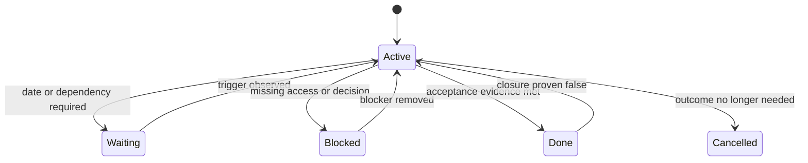

# Architecture

## 1. The task object

Every task should preserve at least these fields:

```yaml
id: stable-id
outcome: observable result
current_state: confirmed facts only
next_action: one concrete move
next_actor: human | ai | collaborator
priority: today | this_week | scheduled | parked
wake_trigger: date, dependency, or external change
acceptance_criteria: evidence required for closure
source: where the task came from
status: active | waiting | blocked | done | cancelled
```

The model may propose values. A human confirms owners, deadlines, sensitive decisions, and irreversible actions.

## 2. The four lanes

| Lane | Meaning |
| --- | --- |
| Human | Requires judgment, communication, approval, or final acceptance |
| AI | Can be researched, drafted, compared, or checked independently |
| Collaborator | A direct report, teammate, partner team, or external collaborator owns the next move |
| Waiting | No useful action exists until a trigger occurs |

A task belongs to one active lane at a time. Final acceptance by a human does not mean the task must remain in the human lane throughout execution.

### Direct-report handoff

When the next actor is a direct report, generate a short daily assignment list containing the intended result, concrete next move, expected evidence, known dependency, and escalation condition. The manager reviews the list before it becomes an assignment. Do not convert activity traces into performance judgments.

## 3. State transitions



“Done” is reversible when new evidence proves the acceptance criteria were not actually met.

## 4. Daily frontstage and backstage

The **frontstage** contains only work that needs action today, is near a real deadline, or has a meaningful new risk. The **backstage** retains all other task identities and triggers without showing them every day.

This separation protects attention without deleting commitments.

## 5. Learning loop

At the end of each day, record only reusable corrections:

- a priority pattern the AI misunderstood;
- a completion signal that proved unreliable;
- a routing rule that repeatedly worked;
- a trigger that was too early or too late.

One-off preferences do not become permanent rules until the user confirms them.

## 关联

- [Quick start](quickstart.md)
- [Calibration guide](calibration-guide.md)
- [Task ledger](../templates/task-ledger.md)

## 来源与证据

- This document is a public abstraction of a real personal workflow; it contains no private task content.

## 修改记录

- 2026-09-19: Initial public architecture.
